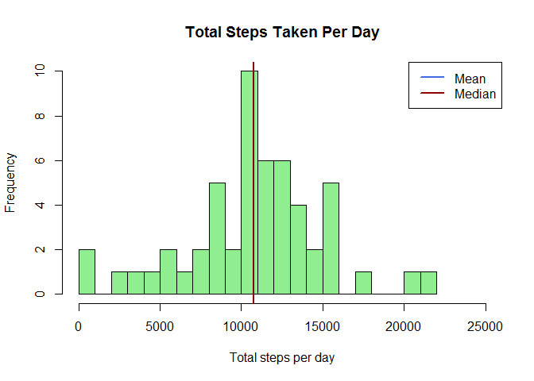
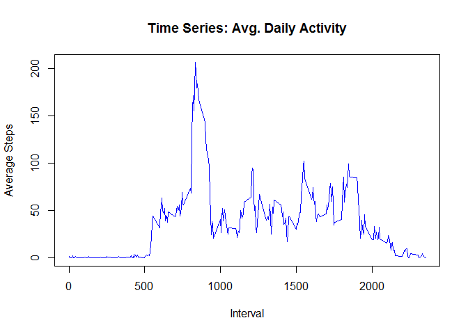
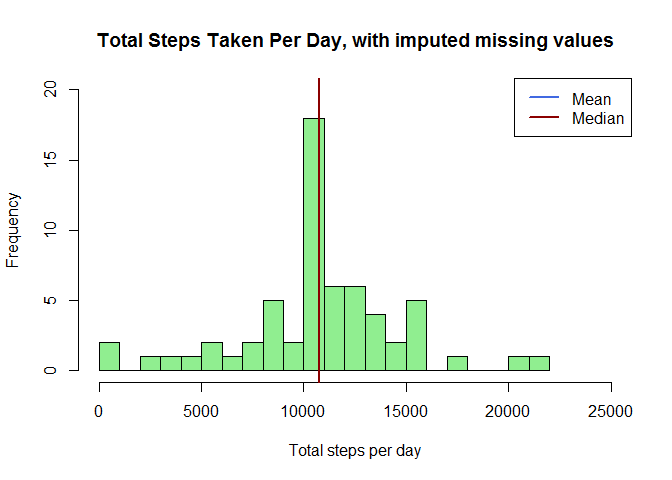
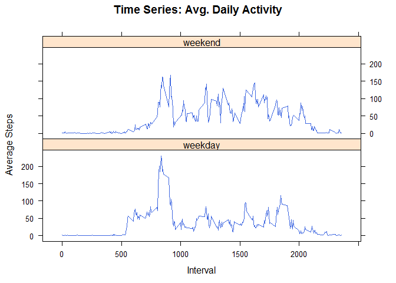

# Reproducible Research: Peer Assessment 1
Saturday, September 20, 2015  

## Introduction

This assignment is about how to create literate programming and address the problems provided in the document. Entire data and all problem specifications are provided in [README.md](https://github.com/git-madhav/RepData_PeerAssessment1/blob/master/README.md) in the git-hub repository, where you find this document. Dataset used for this assignment is available at [activity.zip](https://github.com/git-madhav/RepData_PeerAssessment1)

## Assumptions

This literate program assumes following

* Uses combination of lattice and basic plot system of R.
* Uses lattice, dplyr, broman packages. Assumes they are installed.
* Assumes dataset provided as a part of [forked repository](https://github.com/rdpeng/RepData_PeerAssessment1) from the instructor of the class, is in the same directory as this Rmd document.  

## Loading and preprocessing the data

File provided is a zip file. Unzip and read the file and convert all empty or invalid values to NA. 


```r
# Data file to be used
zipFileName <- "activity.zip"
unzip(zipFileName)

# csv File to read
csvFile <- "activity.csv"
activity.orig.df <- read.csv(csvFile, na.strings=c("NA","#DIV/0!",""))

# Check the data
str(activity.orig.df)
```

```
## 'data.frame':	17568 obs. of  3 variables:
##  $ steps   : int  NA NA NA NA NA NA NA NA NA NA ...
##  $ date    : Factor w/ 61 levels "2012-10-01","2012-10-02",..: 1 1 1 1 1 1 1 1 1 1 ...
##  $ interval: int  0 5 10 15 20 25 30 35 40 45 ...
```

```r
# Count how many NA's are present.
totalMissingValues <- sum(is.na(activity.orig.df$steps))

# load dplyr library
library(dplyr)

# create a subset without missing values
activity.df <- filter(activity.orig.df, !is.na(steps))
```

By examining the data there are 2304 missing values in measuring number of steps. 

## What is mean total number of steps taken per day?

Here we need show mean total number of steps per day as histogram and calculate mean and median of mean total number of steps per day.

First transform the data to allow us calculate and display histogram using "dplyr" package.


```r
# Group the initial data by Date
byDate <- group_by(activity.df, date)

# Summarize the data by calculating total steps per day
sumDate <- summarise(byDate, totalSteps = sum(steps))
```

Plot the histogram using R base plotting system. Also draw lines representing mean and median values. 


```r
# create histogram of number of steps per day Vs frequency
hist(sumDate$totalSteps, breaks = 20, xlab = "Total steps per day", main = "Total Steps Taken Per Day", col = "lightgreen", xlim = c(0, 25000))
abline(v = mean(sumDate$totalSteps), col = "royalblue", lwd = 2)
abline(v = median(sumDate$totalSteps), col = "darkred", lwd = 2)
legend(x = "topright", c("Mean", "Median"), col = c("royalblue", "darkred"), lwd = c(2, 2))
```

 

Calculate mean and median values of Total number of steps per day.


```r
# this will help control the floating point output for inline r output.
library(broman)

# calculate mean steps
meanSteps <- mean(sumDate$totalSteps)
meanSteps
```

```
## [1] 10766.19
```

```r
# calculate median steps
medianSteps <- median(sumDate$totalSteps)
medianSteps
```

```
## [1] 10765
```

Mean value of Total Number of Steps per day is 10766.19

Median value of Total Number of Steps per day is 10765

## What is the average daily activity pattern?

Here we need to plot average steps per 5 min interval across all days. Also calculate which 5 min interval recorded maximum number of average steps.

First transform the data using "dplyr" package and then plot the data.


```r
# Group by 5 min. interval
byInterval <- group_by(activity.df, interval)

# Summarize data by calculating average number of steps per each 5 min
# interval
meanStepsInterval = summarise(byInterval, meanSteps = mean(steps))

# Plot the data using base ploting system.
plot(x = meanStepsInterval$interval, y = meanStepsInterval$meanSteps, type = "l", xlab = "Interval", ylab = "Average Steps", main = "Time Series: Avg. Daily Activity", col = "Blue")
```

 

```r
# calculate which interval has recorded highest average number of steps.
maxIntervalSteps <- meanStepsInterval[which.max(meanStepsInterval$meanSteps),]

# print the value.
maxIntervalSteps
```

```
## Source: local data frame [1 x 2]
## 
##   interval meanSteps
## 1      835  206.1698
```

Interval number 835 has recorded maximum average number of steps 206.1698

## Imputing missing values

We have already see above there are 2304 missing values.

After examing, entire first day missing values, taking an average daily value doesn't work. Take the average interval value across all days as a value to fill missing values. In previous section we have already transformed and calculated average number of step for each 5 min interval. We will use that data again here.


```r
# copy the original data
activity.df.full <- activity.orig.df

# missing values list
na.values <- is.na(activity.df.full$steps)

# create a list of average steps per 5 min interval and store names as 
# 5 min interval.
mSteps <- meanStepsInterval$meanSteps
names(mSteps) = as.character(meanStepsInterval$interval)

# fill/impute the values
activity.df.full$steps[na.values] <- mSteps[as.character(activity.df.full$interval[na.values])]

# check if there are any more missing values.
missingValues <- sum(is.na(activity.df.full$steps))
missingValues
```

```
## [1] 0
```

Now that we have 0 missing values. Calculate mean and median of total number of steps per day. Also plot histogram of the total steps. Similar to in second step, transform and calculate total number of steps per day using "dplyr" package.

Calculate

```r
# Transform the data and summarise to calculate total number of steps.
byDate.full <- group_by(activity.df.full, date)
sumDate.full <- summarise(byDate.full, totalSteps = sum(steps))

# calculate mean value of total number of steps per day.
meanSteps.full <- mean(sumDate.full$totalSteps)

# calculate median value of total number of steps per day.
medianSteps.full <- median(sumDate.full$totalSteps)

# pring values
meanSteps.full
```

```
## [1] 10766.19
```

```r
medianSteps.full
```

```
## [1] 10766.19
```

Mean value of total number of steps per day : 10766.19

Median value of total number of steps per day : 10766.19

After filling the values with average 5 min interval number of steps, mean and median values are same. Median value is changed from earlier data, with missing values. This is due to the imputed values we did using average 5 min interval number of steps. 

Now let us plot the histogram to see how it differs. Peak value frequency is different (higher) now with imputed values, when compared to without imputed values, as you will notice in the plot below.


```r
# Plot the histogram.
hist(sumDate.full$totalSteps, breaks = 20, xlab = "Total steps per day", main = "Total Steps Taken Per Day, with imputed missing values", col = "lightgreen", xlim = c(0, 25000), ylim = c(0, 20))
abline(v = mean(sumDate.full$totalSteps), col = "royalblue", lwd = 2)
abline(v = median(sumDate.full$totalSteps), col = "darkred", lwd = 2)
legend(x = "topright", c("Mean", "Median"), col = c("royalblue", "darkred"), lwd = c(2, 2))
```

 

## Are there differences in activity patterns between weekdays and weekends?

First transform the data using "dplyr" package. First create day and dayType columns that indicate day of the week and if it is weekend or weekday. We will be using data set with imputed values.


```r
# copy the full data set (after imputed values)
fullData.df <- activity.df.full

# use mutate function to create day of the week columns with "day" as name.
fullData.df <- mutate(fullData.df, day = weekdays(as.Date(date)))

# Now create "dayType" to indicate if the day is weekend or weekday.
fullData.df <- mutate(fullData.df, dayType = ifelse(day == "Saturday" | day == "Sunday", "weekend", "weekday"))

# convert the dayType to a factor variable, with two levels.
fullData.df$dayType <- as.factor(fullData.df$dayType)
```

Now that new column is create which indicates weekend or weekday. Plot the data to see the differences in activity between weekend and weekday. To do this, we need to transform the data again to calculate 5 min interval acros all days corresponding to weekends and weekdays.


```r
# Arrange data by grouping first by interval and then by dayType
byInterval.full <- group_by(fullData.df, interval, dayType)

# calculate the average number of steps per interval per dayType
meanStepsInterval.full <- summarise(byInterval.full, meanSteps = mean(steps))

# Use lattice plot system to plot the time series data.
library(lattice)

xyplot(meanSteps ~ interval | dayType, data = meanStepsInterval.full, type = "l", main = "Time Series: Avg. Daily Activity", ylab = "Average Steps", xlab = "Interval", layout = c(1, 2), col = "royalblue")
```

 

Based on above plot, it appears at the begning of weekday activity is higher, where as for weekend activity is evenly spread throught the day. It probably make sense that most of the objects are busy during the weekday office hours. 
